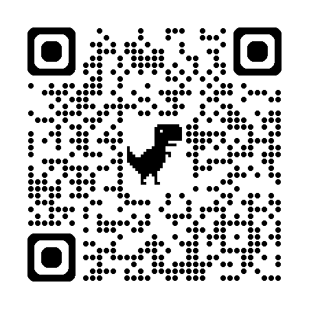

# GyroCube
 Self Balancing Cube Project

Balancing Cube project based on the "remrc" model: https://www.thingiverse.com/thing:6695891

    Creation of an Application to facilitate calibration and motor testing,
    Merging the main program with the motors test program,
    Creation of a printed circuit for those who wish to have a beautiful object (coming soon),
    Addition of a Power button,
    Addition of a button to turn on the LEDs and change their colors,
    Modified the face files for placing the switches in 12 and 16mm. Thanks to dinomight.

Explanatory video: https://youtu.be/hunA4mQBg2g
Led function video: https://youtu.be/vczHyelNjr4

# 12-5-2024 (Dinomight/Darkmadda)
Added new [BLE firmware](esp32_cube_vBLE_en/) this has a browser based config tool (can be use on android/mac/pc via chrome). This firmware is backwards compatible with other app config methods (Bluetooth Serial, Pedro android app). I however think the new BLE tool is superior. I'm a little biased but try it you'll see. no need to host the app i set it up on hosting that should never go away https://idoxa55.sufydely.com/cubeConfigTool.html. 